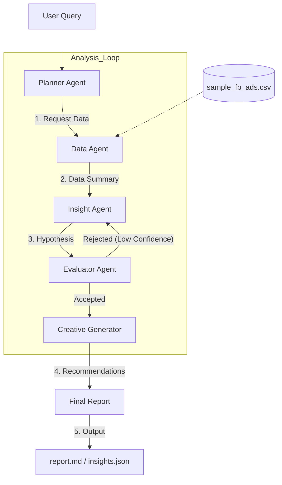

# Kasparro Agentic System Architecture

This document outlines the multi-agent architecture used to diagnose Facebook Ads performance. The system follows a structured **Planner-Evaluator** pattern to ensure insights are not just generated, but quantitatively validated before being presented to the user.

## System Diagram

## Agent Roles & Responsibilities

### 1. Planner Agent (`planner.py`)
* **Role:** The orchestrator. It decomposes the high-level user query (e.g., "Why did ROAS drop?") into a step-by-step execution plan.
* **Input:** User string.
* **Output:** Structured JSON plan.

### 2. Data Agent (`data_agent.py`)
* **Role:** The interface to the raw CSV dataset. It performs aggregations, filtering, and summarization to prevent context window overflow in downstream agents.
* **Input:** Raw CSV data + Planner constraints.
* **Output:** Summarized Pandas DataFrames or text summaries.

### 3. Insight Agent (`insight_agent.py`)
* **Role:** The analyst. It analyzes the summarized data to generate qualitative and quantitative hypotheses about performance drivers (e.g., "Ad fatigue in the 18-24 demographic").
* **Input:** Data summaries.
* **Output:** List of hypotheses with reasoning.

### 4. Evaluator Agent (`evaluator.py`)
* **Role:** The gatekeeper. It takes the Insight Agent's hypotheses and performs strict quantitative checks to calculate a confidence score.
* **Key Mechanic:** If confidence < Threshold (0.6), the hypothesis is flagged or rejected.
* **Input:** Hypotheses + Raw Data verification.
* **Output:** Validated `insights.json` with confidence scores.

### 5. Creative Improvement Generator (`creative_generator.py`)
* **Role:** The copywriter. For campaigns identified as having "Low CTR" or "Ad Fatigue," it generates new headlines and messaging based on high-performing historical examples.
* **Input:** Low-performing ads + High-performing ads (few-shot context).
* **Output:** `creatives.json`.

## Data Flow

* **Ingestion:** The **Data Agent** loads `data/sample_fb_ads.csv` into a Pandas DataFrame.
* **Processing:** Raw data is aggregated into daily or campaign-level summaries.
* **Synthesis:** Summaries are passed to the **Insight Agent** (LLM) to generate JSON hypotheses.
* **Validation:** The **Evaluator** re-calculates metrics against the raw dataframe to verify the LLM's claims (e.g., confirming ROAS actually dropped by X%).
* **Generation:** Validated insights drive the **Creative Generator** to produce new text strings.
* **Persistence:** Final outputs are saved to `reports/` as JSON and Markdown.
